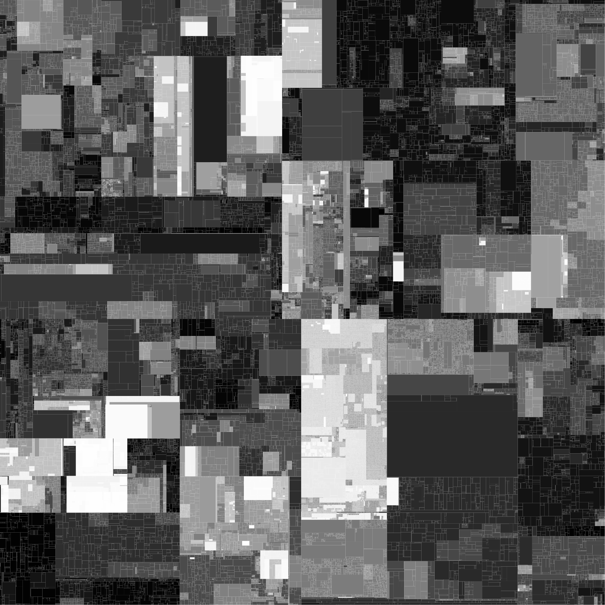
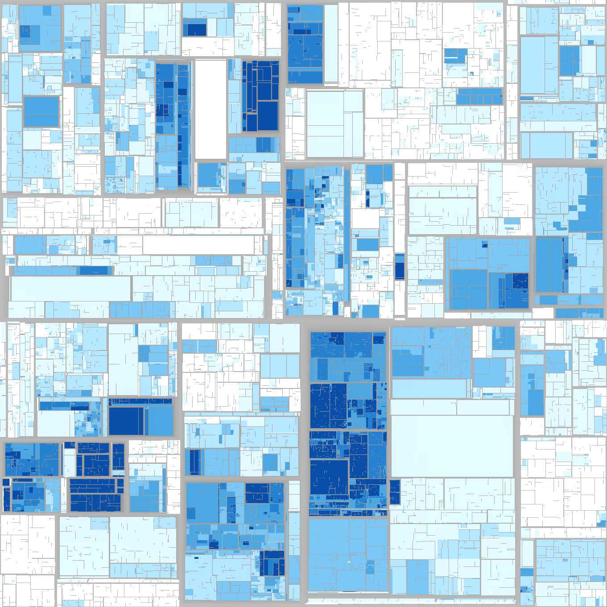

# Hilbert and Moore Treemap Layouts Prototype

This repository will contain the C++ prototype for a research paper submitted to the EuroVis 2021.
The source code, datasets, and scripts will be released with the publication of the paper.

When you use parts of this repository within your publications, consider referencing its accompanying publication:

* Willy Scheibel, Christopher Weyand, Joseph Bethge, and Jürgen Döllner: "Algorithmic Improvements on Hilbert and Moore Treemaps for Visualization of Large Tree-structured Datasets". In Proc. EuroVis 2021 - Short Papers. The Eurographics Association, 2021. doi: [10.2312/evs.20211065](https://doi.org/10.2312/evs.20211065)

Example layout of the Firefox source code:

Firefox Layout             |  Firefox Treemap Screenshot
:-------------------------:|:-------------------------:
  |  

## Notes for Practitioners

The prototype is a command-line-based tool to load CSV-encoded text files that contain path-encoded nodes and additional attributes that can be selected as weights for the layout computation.
The tool is capable of reading the data, derive a tree structure, and perform preprocessing and layouting of Hilbert and Moore treemaps for datasets with millions of nodes.
The main output of the tool is the resulting layouts both in plain text and SVG format. The layouting process can be measured by means of run-time performance and the resulting layouts can be assessed using treemap layout techniques.

### Setup

The command-line tool has the following dependencies:

* C++17
* CMake

### Compilation

This project is generally buildable by using a standard CMake setup with the `CMakeLists.txt` in the project root.
As a small shortcut, you can use the `configure` script as well:

```bash
$ ./configure # sets up a local config directory
$ ./configure
$ cmake --build build
```

### Command-line Interface

The main build target of this project is the `hilbert-moore-treemap-layouts` command-line program.
This program exposes the following arguments:

```
hilbert-moore-treemap-layouts

# Treemap configuration
--dataset [file]
    a file containing nodes and weight data
--datasets [file]
    a file whose contents are paths to dataset files (use in combination with --datasets-prefix)
--datasets-prefix [path]
    the path prefix for dataset identifiers from a datasets file
--weights [string]
    select the column to use as weight data
--partition [greedy|minmax|minvariance]
    choose the partitioning algorithm
--algorithm [hilbert|moore]
    choose the space-filling curve
--
    read dataset files from stdin

# Measurements
-pm
    measure and output run-time performance
-lm
    measure and output layout metrics
-es
    export last layout as svg
-el
    export last layout as in text format (left, bottom, with, height)
-p
    print dataset statistics
```

### Steps for Reproduction of the Results

The scripts are based on bash and Python 3.

```bash
$ ./scripts/statistics.sh
$ ./scripts/screenshots.sh
$ ./scripts/performance-measurements.sh
$ ./scripts/layout-metrics-measurements.sh
```

The results are stored in the `resources` directory.

## Notes for Researchers and Collaborators

The tool is currently limited to layout creation, including the required preprocessing steps and the measurements. For this to get a full and usable visualization tool, a rendering component, a more sophisticated geometry creation, and a scene management are required, too.

If your are interested in the visualization of tree-structured data or further resources from us, feel free to contact us for a collaboration.

Contact:
 * Willy Scheibel ([willy.scheibel@hpi.de](mailto:willy.scheibel@hpi.de))

## Gallery

### High-Res Firefox Layout


